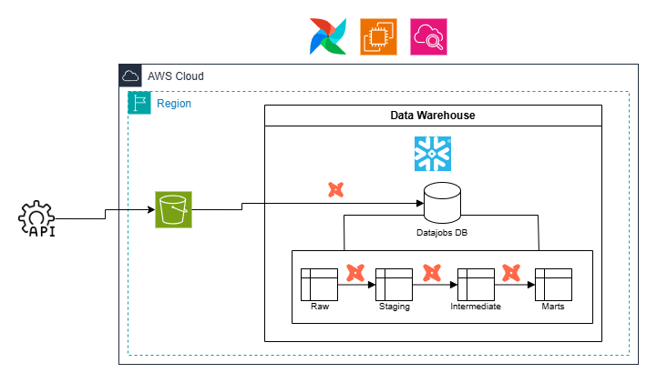
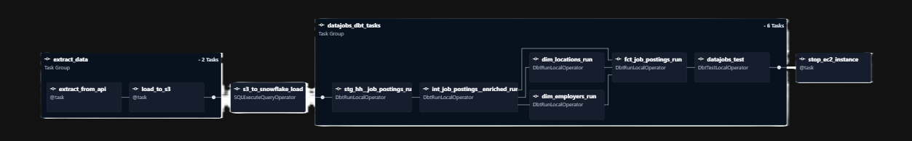
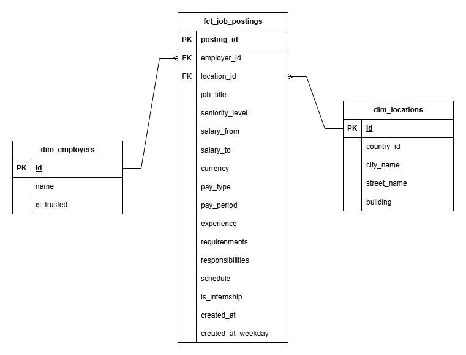
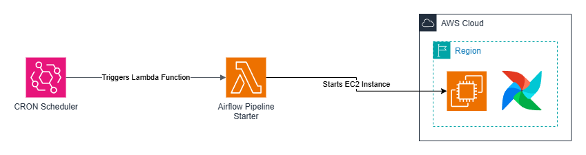

# datajobs-elt

An end-to-end ELT pipeline that collects **Data Engineer job postings from hh.ru**, loads them
into Snowflake via S3, and transforms them into an analytical star schema using dbt.
Orchestrated by Apache Airflow 3 on AWS EC2.

---

## Architecture

The pipeline follows a classic ELT pattern across three stages:

1. **Extract** — Python fetches job postings from the hh.ru API and writes raw JSON to S3.
2. **Load** — Snowflake ingests the raw files from S3 into a raw schema via `COPY INTO`.
3. **Transform** — dbt transforms the raw data through staging → intermediate → marts layers.

---

## Pipeline Walkthrough

The Airflow DAG runs daily at **01:00 UTC+3** and executes the following chain:

### 1. Extract

A Python `@task` hits the hh.ru API with `text="Data Engineer"` and writes paginated
results as raw JSON to S3. The task uses Airflow's execution date context to partition
files by run date.

### 2. Load

A second `@task` runs a `COPY INTO` command that ingests the S3 JSON files into the
`RAW` schema in Snowflake, with the raw payload stored in a `VARIANT` column.

### 3. Transform (dbt via Cosmos)

`dbt_tasks` is an Astronomer Cosmos `DbtTaskGroup` that runs the full dbt project.
Each dbt model becomes an individual Airflow task, giving per-model visibility in the
Airflow UI. The transformation layers are:

- **Staging** — flattening, light cleaning and type casting over the raw `VARIANT` columns.
- **Intermediate** — data enrichment with macros and regular expressions.
- **Marts** — a star schema optimised for analytical queries:
  - `fct_job_postings` — one row per job posting with measures and foreign keys.
  - `dim_employers` — deduped employer dimension.
  - `dim_locations` — deduped location dimension.

### 4. EC2 Shutdown

After `dbt_tasks` completes, `stop_ec2_instance` calls the AWS API via `boto3` to stop
the EC2 host, keeping compute costs near zero between daily runs.

---

## Data Model

Surrogate keys in `dim_locations` are generated with `dbt_utils.generate_surrogate_key()`. Relationships are enforced via dbt `relationships` tests.

---

## EC2 Instance Starter

EC2 instance where the pipelins is running starts on CRON schdeule.

